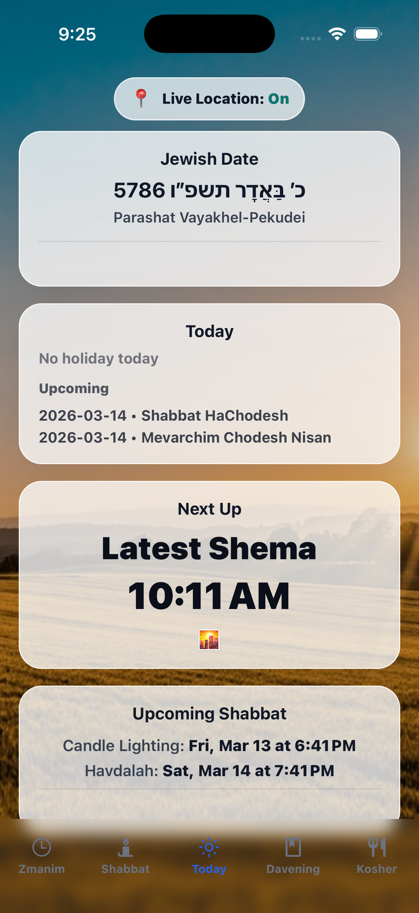
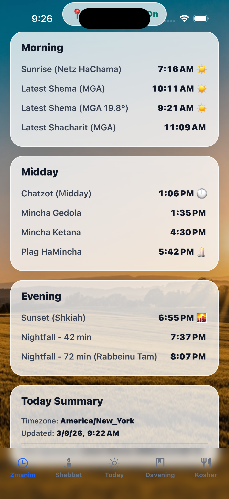
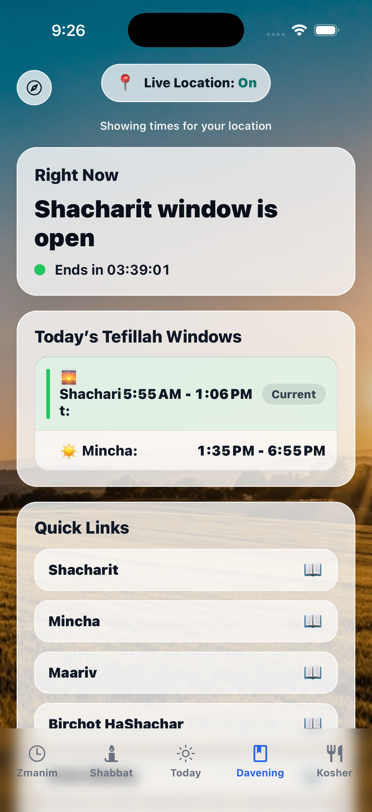
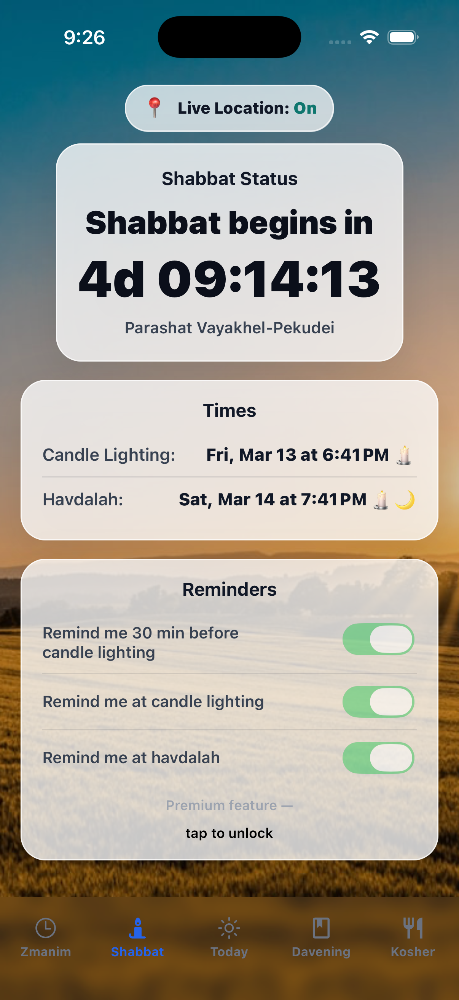
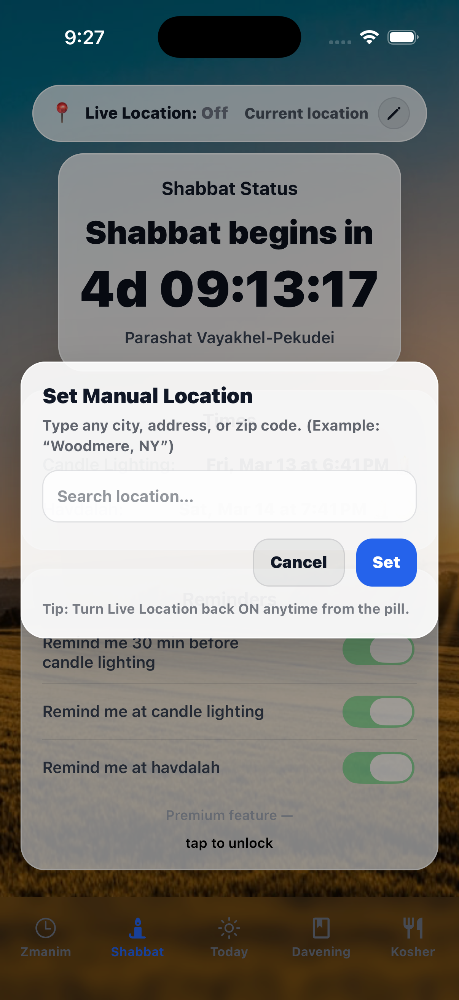
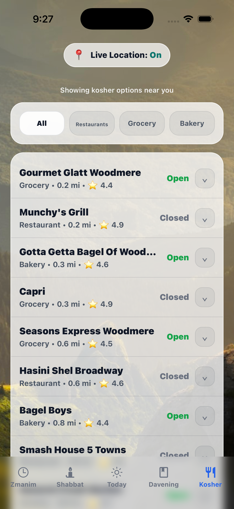
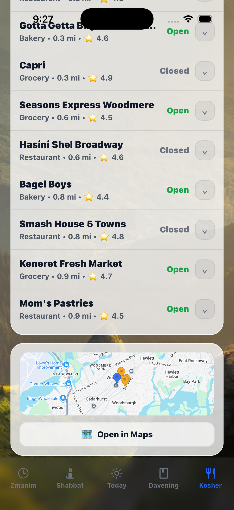
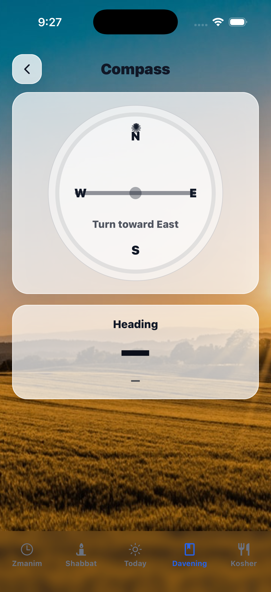

# AllJew

AllJew is a modern Jewish daily life utility app built with React Native (Expo).

The app provides users with essential daily Jewish tools including:

• Zmanim (halachic times based on location)
• Sunrise and sunset calculations
• Premium subscription features
• Clean, modern minimalist design
• iOS-ready architecture

---

## 🚀 Tech Stack

- React Native (Expo Dev Client)
- TypeScript
- RevenueCat (subscription management)
- tz-lookup
- Geolocation APIs

---

## 💡 Purpose

I built AllJew to combine clean tech design with meaningful daily Jewish functionality. 
The goal was to create a reliable, modern, and production-ready app that simplifies Jewish daily observance tools into one intuitive interface.

---

## 📸 App Screenshots

### Today Screen

### Zmanim Screen

### Davening Screen

### Shabbat Screen

### Location Screen

### Kosher Finder

### Compass

---

## 📱 Current Status

- 90% production complete
- Subscription paywall implemented
- iOS-ready
- Peer-reviewed UI refinements in progress

---

## 📌 Future Improvements

- Android production build
- Expanded zmanim calculations
- Push notification reminders
- Community-requested features

---

## 👨‍💻 Developer

Zachary Strauss  
Student Developer  
HAFTR High School